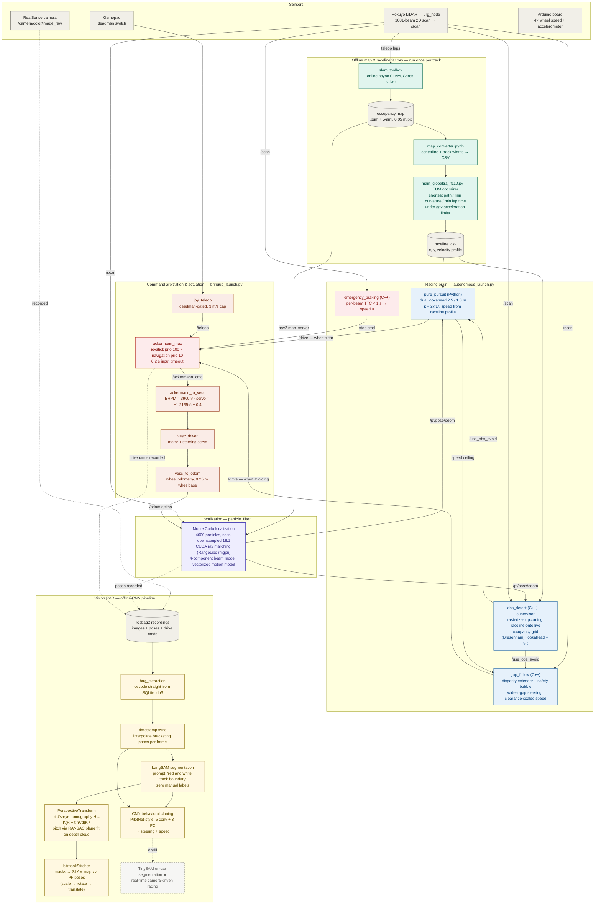
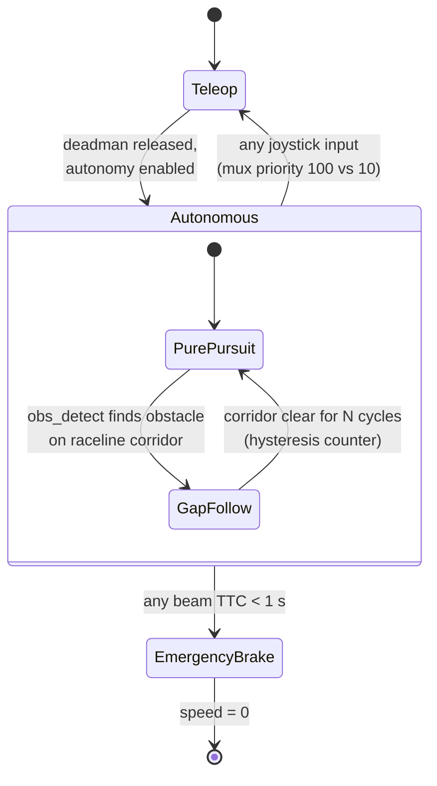
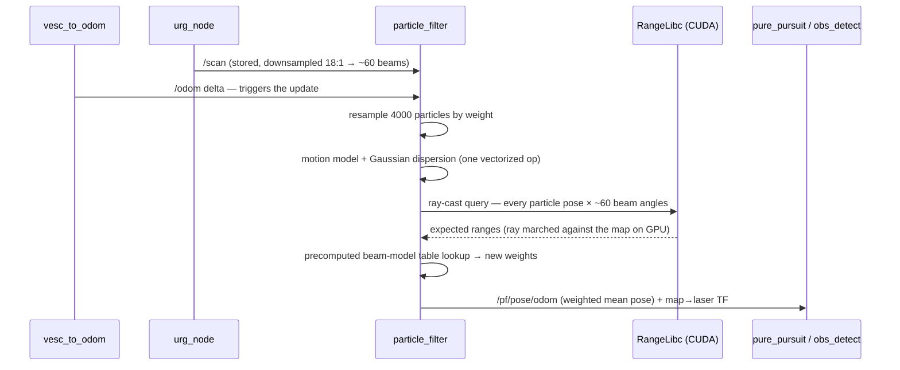

# Autonomous Race Car — system design

> How a hallway becomes a race track.
>
> A LiDAR-equipped 1/10-scale car drives the track once under human control
> while **SLAM** builds a map. An **offline optimizer** turns that map into the
> fastest feasible raceline with a per-waypoint speed profile. On race day, a
> **GPU particle filter** tells the car where it is 4000 hypotheses at a time,
> **pure pursuit** chases the raceline, and a **supervisor** watches the road
> ahead — the instant an obstacle blocks the line, a reactive **follow-the-gap**
> planner takes the wheel until the path is clear. A human deadman switch and a
> time-to-collision watchdog sit above everything.

This document is the developer-facing map of the whole system — every node,
**built or planned**, and how data moves between them. Read the flowchart
top-to-bottom; dashed nodes are the roadmap.

---

## End-to-end flowchart

**Legend** — ⬜ sensors / data · 🟩 offline factory (SLAM + raceline) · 🟪
localization · 🟦 racing brain · 🟥 safety layers · 🟧 drivers / actuation ·
🟨 vision R&D · ◌ dashed = planned (not yet built).

---

## How to read it: the three flows that matter

1. **Two timescales, one interface.** The green offline factory runs *once per
   track* (drive laps → SLAM map → optimized raceline). The online loop runs
   continuously and only ever sees two artifacts from it: the map (fed to the
   particle filter) and the raceline CSV (fed to pure pursuit *and* obs_detect —
   both read the same file, so the supervisor always checks exactly the corridor
   the tracker intends to drive).

2. **The supervisor never steers** (the `/use_obs_avoid` edges). `obs_detect`
   only answers one question each scan: *does anything intersect the raceline
   segment the car is about to drive?* On `true`, pure pursuit goes silent and
   gap_follow publishes to the same `/drive` topic — exactly one controller
   speaks at a time. A hysteresis counter keeps avoidance latched for several
   clear cycles so control doesn't chatter mid-corner, and gap_follow inherits
   pure pursuit's profile speed as its ceiling so avoidance never out-runs the
   plan.

3. **Safety is layered, not centralized** (the red nodes). The mux gives the
   human joystick strictly higher priority than autonomy with a 0.2 s timeout —
   release the deadman and the car coasts to a stop. Below that, an independent
   time-to-collision watchdog brakes when any beam predicts impact within 1 s,
   and gap_follow's corner check vetoes hard turns when a side wall is under
   0.5 m away. Any layer can stop the car; none can override a human.

The **★ TinySAM node** is the vision pipeline's north star: everything upstream
of it already exists (auto-labeled masks, a trained driving CNN) — it just
hasn't been distilled into a model fast enough to run on the Jetson in the
control loop.

---

## Deep dive 1 — control arbitration

## Deep dive 2 — one particle filter update

The beam model is a 4-component mixture precomputed into a lookup table at
startup: a Gaussian around the expected range (`z_hit`), a short-reading ramp
for unexpected obstacles (`z_short`), a max-range spike (`z_max`), and uniform
noise (`z_rand`). Weights are softened with `w^(1/2.2)` so a single bad beam
can't kill a good hypothesis.

---

## Component inventory

| Component | Layer | Tech | Status | Where |
|---|---|---|---|---|
| urg_node (Hokuyo driver) | Sensors | C++ | ✅ built | `darc_f1tenth_system/f1tenth_stack/config/sensors.yaml` |
| vesc_driver | Actuation | C++ | ✅ built | `darc_f1tenth_system/vesc/vesc_driver/` |
| ackermann_to_vesc / vesc_to_odom | Actuation | C++ | ✅ built | `darc_f1tenth_system/vesc/vesc_ackermann/` |
| ackermann_mux | Safety | C++ | ✅ built | `darc_f1tenth_system/ackermann_mux/` |
| joy_teleop | Teleop | Python | ✅ built | `darc_f1tenth_system/teleop_tools/` |
| darc_arduino bridge | Sensors | Python | ✅ built | `darc_f1tenth_system/darc_arduino/` |
| slam_toolbox config | Offline factory | — | ✅ built | `darc_f1tenth_system/f1tenth_stack/config/f1tenth_online_async.yaml` |
| Map converter | Offline factory | Python / Jupyter | ✅ built | `Raceline-Optimization/map_converter.ipynb` |
| Raceline optimizer | Offline factory | Python (TUM) | ✅ built | `Raceline-Optimization/main_globaltraj_f110.py` |
| Particle filter (MCL) | Localization | Python + CUDA | ✅ built | `particle_filter/particle_filter/particle_filter.py` |
| Velocity calculator | Localization | Python | ✅ built | `darc_f1tenth_system/darc_tools/` |
| pure_pursuit | Racing brain | Python | ✅ built | `f1tenth_gym_ros/src/pure_pursuit/` |
| obs_detect (supervisor) | Racing brain | C++ / Eigen | ✅ built | `f1tenth_gym_ros/src/obs_detect/` |
| gap_follow | Racing brain | C++ | ✅ built | `f1tenth_gym_ros/src/gap_follow/` |
| emergency_braking | Safety | C++ | ✅ built | `f1tenth_gym_ros/src/emergency_braking/` |
| Simulator bridge | Sim | Python / Docker | ✅ built | `f1tenth_gym_ros/src/f1tenth_gym_ros/` |
| Bag extraction | Vision R&D | Python / SQLite | ✅ built | `bag_extraction/` |
| Timestamp sync + frame curation | Vision R&D | Python | ✅ built | `automatic_bitmask_stitching/` |
| LangSAM segmentation | Vision R&D | PyTorch (Colab) | ✅ built | `automatic_bitmask_stitching/LangSAM.ipynb` |
| Bitmask filtering | Vision R&D | Python / OpenCV | ✅ built (unit tested) | `bitmask_filtering/` |
| Perspective transform (IPM) | Vision R&D | Python / Open3D | ✅ built | `PerspectiveTransform/` |
| Bitmask stitcher | Vision R&D | Python / OpenCV | ✅ built | `automatic_bitmask_stitching/bitmaskStitcher.py` |
| Driving CNN | Vision R&D | TensorFlow / Keras | ✅ built (offline) | `CNN/cnn_model.py` |
| TinySAM real-time segmentation | Vision R&D | — | ⬜ planned | — *(north star, `CNN/proposal_pipeline.md`)* |
| On-car CNN deployment | Vision R&D | — | ⬜ planned | — |

---

## The numbers that matter

| Value | What it is |
|---|---|
| 4000 | particles in the Monte Carlo localizer |
| 1081 → ~60 | LiDAR beams per scan → beams the sensor model actually ray-casts (18:1 downsample) |
| 0.05 m/px | SLAM map resolution |
| 2.5 m / 1.8 m | pure pursuit lookahead above / below the 4 m/s speed threshold |
| `L = v · t_buffer` | obs_detect corridor length — scales with current speed |
| 1 s | time-to-collision threshold for emergency braking |
| 0.2 s | mux input timeout (stale commands are dropped) |
| 100 vs 10 | mux priority: joystick vs navigation |
| 3900 | motor ERPM per m/s (VESC calibration) |
| −1.2135 / +0.4 | steering-angle → servo gain / offset |
| 0.25 m | wheelbase (odometry + steering geometry) |
| 0.6 m | car width used for gap-follow disparity bubbles |
| 200 × 66 × (1 or 4) | CNN input: bitmask-only or RGB+bitmask |

---

## Race-day workflow

| Stage | Name | What happens | Status |
|---|---|---|---|
| 1 | Mapping | teleop laps + `slam_launch.py` → save `.pgm`/`.yaml` from RViz | ✅ routine |
| 2 | Raceline | clean map boundaries → `map_converter` → TUM optimizer → `raceline.csv` (on a laptop — CPU heavy) | ✅ routine |
| 3 | Configuration | point `particle_filter.yaml`, `pure_pursuit.yaml`, `obs_detect.yaml` at the new map + raceline; `colcon build` | ✅ routine |
| 4 | Localization | `particle_filter_launch.py` + RViz *2D Pose Estimate* to seed the filter | ✅ routine |
| 5 | Race | `autonomous_launch.py` — supervisor arbitrates pure pursuit vs gap follow | ✅ routine |
| 6 | Data capture | rosbag camera + pose + drive topics for the vision pipeline | ✅ routine |
| 7 | Camera-driven racing | TinySAM segmentation → CNN in the control loop | ⬜ planned |

---

## Credits & upstream sources

Built on the F1TENTH open-source ecosystem, adapted and integrated for the DARC
car: the [MIT RACECAR particle filter](https://github.com/mit-racecar/particle_filter)
(+ [RangeLibc](https://github.com/f1tenth/range_libc)) ported to ROS 2;
pure pursuit / gap follow / obs detect adapted from
[ladavis4's ICRA 2022 project](https://github.com/ladavis4/F1Tenth_Final_Project_and_ICRA2022);
raceline optimization from
[TUM FTM](https://github.com/TUMFTM/global_racetrajectory_optimization);
emergency braking referenced from
[UWaterloo CL2](https://github.com/CL2-UWaterloo/f1tenth_ws); simulation via
[f1tenth_gym_ros](https://github.com/f1tenth/f1tenth_gym_ros); segmentation via
[lang-segment-anything](https://github.com/luca-medeiros/lang-segment-anything).
